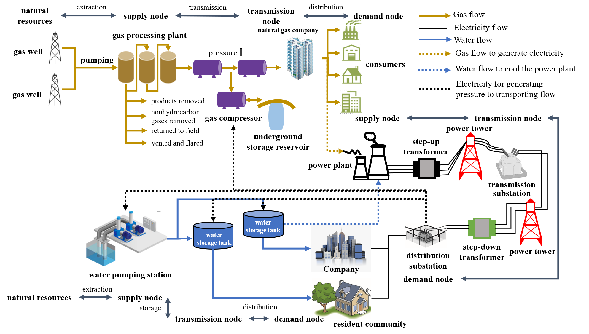
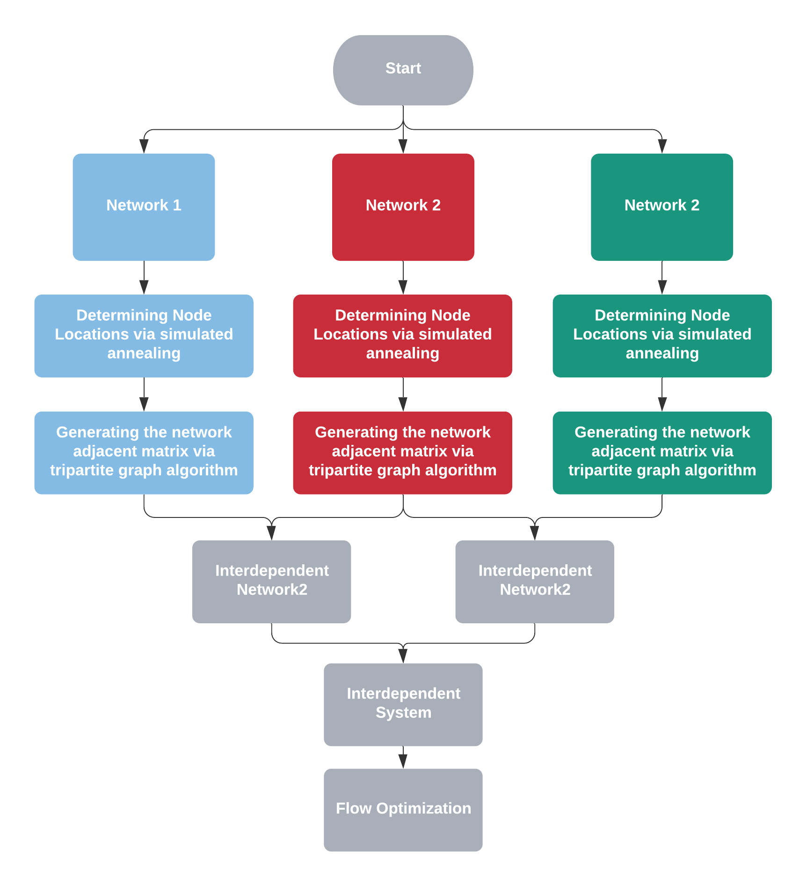

# Interdependent Infrastructure Network Simulation Tool
.. image:: https://img.shields.io/pypi/v/networkx.svg
   :target: https://pypi.org/project/networkx/
   
A comprehensive framework to simulate interdependent infrastructure networks as well as their physical flow, which can be used as test cases for assessing vulnerability and optimizing restoration of interdependent infrastructure networks.

> A typical interdependent gas-power-water networks

## Contents
- __[Motivation](#Motivation)__
- __[Framework](#Framework)__
  - [Data Preparation](#Data)
  - [Algorithm Flowchart](#Flowchart)
- __[Tutorial](#Tutorial)__
- __[Example](#Example)__

## Motivation
Interdependent infrastructure networks provide essential services to modern societies. Their disruptions subjected to natural disasters could lead to catastrophic outcomes, which necessitates the evaluation of the system-level performance in advance. Typically, the system-level performance is estimated by taking real networks as testbeds, simulating failure scenarios and measuring their performance decay along the time. However, complete information on the topology and flow of individual networks and their interdependencies are very often not publicly available due to privacy and security concerns. Therefore, this work provides a comprehensive framework to simulate interdependent infrastructure networks as testbeds for future use. The simulation tool can be easily appled to generate individual infrastructure networks, as well as their interdependencies.
## Framework
Procedures of simulating interdependent infrastructure networks consist of simulating individual networks, setting up interdependent links and initializing the system flow. The first two parts are executed in PYTHON while the flow optimization is approached by IPOPT solver embeded in JULIA.
### Data
(1) **(lon1, lon2, lat1, lat2)**: the geoboundary of the specific territory where the simulated networks are to be embeded. 
(2) **Tract_data**: (lat, lon, population, area) of tracts in the geoboundary (lon1, lon2, lat1, lat2), which can be assessed from [USboundary](https://www.usboundary.com/Areas/Census%20Tract/Tennessee/Shelby%20County). 
(3) **d_lon, d_lat**: the size of the grid after segmentation. 
(4) **network_data**: the dictionary form of the network data for simulating networks, the keys are as follows. 
- **"name"**: the name of the network to be simulated
- **"supplyname", "tranmissionname", "demandname"**: the name of the supply, tranmission and demand nodes
- **"nodenum", "supplynum", "trannum", "demandnum"**: the number of facilities in the whole system, supply, tranmission and demand facilities 

(5) **degree_sequence**: the prescribed degree sequence, a list of node degree values obtained by empirical knowledge or learned from other real infrastructure networks 
(6) **depend_num**: a parameter specifying how many facilities does the specific facility demand resources from 
(7) **internetwork_data**: the dictionary form of the internetwork data for simulating interdependencies, the keys are as follows. 
- **"name"**: the name of the interdependency
- **"network1"**: the network that provide resources to the other network in the interdependency. This is the **network** object initialized beforehand.
- **"network2"**: the network depending on resources from the other network in the interdependency. This is the **network** object initialized beforehand.
- **"dependnum"**: the number of facilities in the network that are relied on by each of the facilities in the other network in the interdependency. 

(8) **flow_data**: parameter used for optimization on network flow, which are collected from multiple sources specified in the paper.
### Flowchart

  

> The flowchart of the algorithm to generate interdependent infrastructure networks

## Tutorial

## Example
(1) The area where the infrastructure systems are to be set up: geographical boundary (lat, lon), the population distribution (in tract sense), the real infrastructure system to be simulated (degree distribution, the number of different type of facilities)
## 3. Tutorial
(1) The interdependent system to be simulated: the topology and the flow
## 4. Example
**** 
### Network topology simulation and analysis are performed in Python
* Basemapset.py: Set up the base backgroud where the infrastructure system is to be set; import the population data here
* Annealing simulation.py: Heuristic search to solve the optimal facility location problem
* Network.py: Network object specificed to define the infrastructure networks; Several important network operations are included: random bipartite graph algorithm, find all paths between certain pair of nodes (i, j), calculate different network topologies
* Sharefunction.py: include the basic function that can be used in general way, shared by all other scripts in the folder
* topologyanalysis.py: initialize networks several times and perform statistical anlaysis of the network topology feature, compare it with networks simulated using other methods (ouyang methods and features of real networks)
* Networkouyang.py: set up networks using ouyang methods
* data.py: specified the data we use for each parameter
* Tract.py: import the population data in tract scale
* Randomlinknetwork.py: Randomly distribute the nodes in 2D plane and connect them only considering the geographical distance
* Shelby_County_network.py: set up the realistic networks in Shelby County
**** 
### Flow simulation is performed through nonliear optimization, which is set up and solved in Julia with Juniper package
* mainprogramming.jl: the main function to set up the solver, decision variables, linear and nonlinear constraints
* python2juliadata.jl: the function to import network data from python to julia
* Sharefunction.jl: the general functions which are shared by all julia scripts in the project
* dataopt.jl: the value of the parameters in the optimization
**** 
### Folder of data
* Edges.xlsx, Nodes.xlsx: the pipeline (grid) and facility information of the gas, power and water infrastructure networks in Shelby County
* Tract.xlsx: The population distribution in Shelby County
**** 
### Folder of PDF
* Interdependent_network_optimization for network flow.pdf: the mathematical formalization of the network flow optimization problem

## 4. To run
First load all modules except the Shelby_County_network.py, the topologyanalysis.py, main.py, mainprogramming.jl
**** 
### For simulating network topology and performing statistical analysis:
* Execuate the Shelby_County_network.py, then run the topologyanalysis.py
**** 
#### For simulating network topology and optimizaion to solve the network flow:
* Execuate the main.py and mainprogramming.jl
